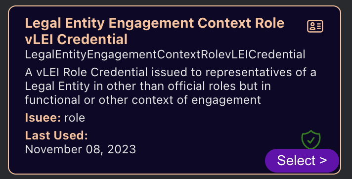

This is the regulatory customer pilot webapp.
It requires a signify enabled browser extension, like the open-source [signify-brower-extension](https://github.com/WebOfTrust/signify-browser-extension), to provide signed headers.
When run in developer mode it uses hardcoded data to test the UI.
Otherwise it should configured to point to the [reg-pilot-api](https://github.com/GLEIF-IT/reg-pilot-api) which uses the [vlei-verifier](https://github.com/GLEIF-IT/vlei-verifier) service.

# Local development
## Build
from the my-app directory:
```npm install```
## Run
from the my-app directory:
```npm start```

# Docker
## Build docker images
```docker-compose build --no-cache```
## Start the docker containers
```docker-compose down```
```docker-compose up deps```

## Seed test data
The browser extension must be configured to point to a KERIA instance.
To seed that instance with a test-identity you can run the singlesig-vlei-issuance.test.ts in the integration-scripts.

From the root project directory make sure you have:
```npm install```

From the my-app directory make sure you have:
```npm install```

From the integration-scripts directory make sure you have:
```npm install```

Then from your IDE or the command line you can run the singlesig-vlei-issuance.test.ts
```npm run:integration integration-scripts/singlesig-vlei-issuance.test.ts```

You will want to look for the output:
```SIGNIFY_SECRETS="CIsYzCGKpY6FcA1dSnjEje,AHfiDXoQ1zy_UyLhwisFwX,DB5HHvV1HJU7cJWgMUJMnU,CGbMVe0SzH_aor_TmUweIN```

The last secret in that comma-separated list is the role AID secret that you will use for your KERIA instance.
If you already know the secrets you want to use then you can do:
```SIGNIFY_SECRETS="CIsYzCGKpY6FcA1dSnjEje,AHfiDXoQ1zy_UyLhwisFwX,DB5HHvV1HJU7cJWgMUJMnU,CGbMVe0SzH_aor_TmUweIN npx jest singlesig-vlei-issuance.test.ts```

## Configure the extension for docker
* agent url is `http://localhost:3901`
* boot url is `http://localhost:3903`
* 

## Use the last SIGNIFY_SECRET we specified as your passcode for the 'role' sign in
```CGbMVe0SzH_aor_TmUweIN```
* 

## Choosing the ECR credential
* Note: that the ECR authorization credential won't work!
* Select the Engagement Context Role (ECR) credential
    * 
* In order to avoid having to reselect the ECR credential, enable auto-sign in
    * 
